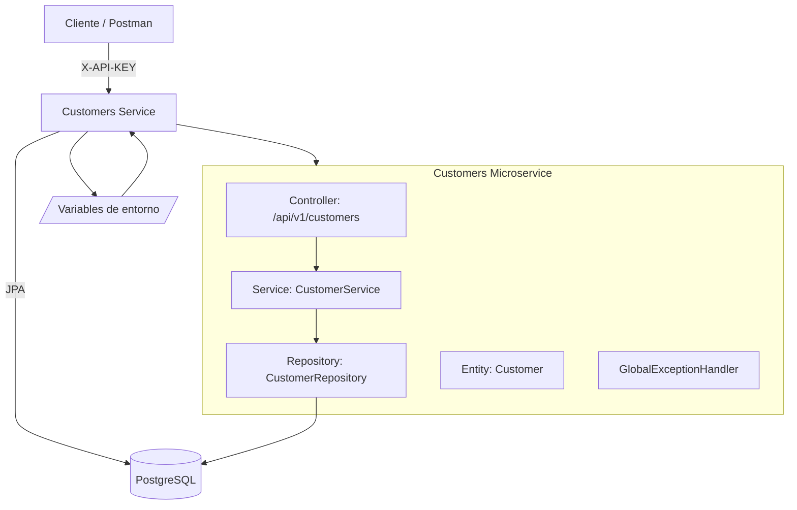
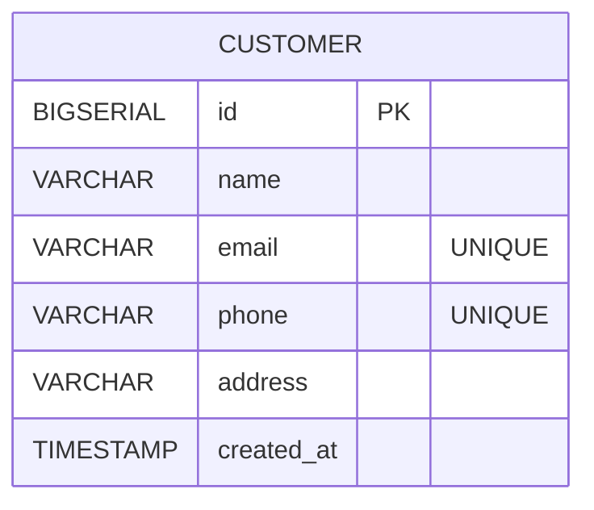

# 👤 Customers Service — Farmatodo (Reto Técnico Backend)

**Microservicio de Gestión de Clientes**  
Stack: **Spring Boot 3.5.6** · **Java 17** · **PostgreSQL** · **Docker** · **API Key** · **Swagger** · **JPA/Hibernate**

Este servicio expone APIs para **crear, listar, consultar, actualizar (PUT/PATCH) y eliminar** clientes; valida **unicidad de email y teléfono**; maneja **errores/validaciones** en formato JSON consistente; y se ejecuta en **Docker** con su propia base de datos.

---

## 📦 Objetivos del micro

- Registrar clientes con:
    - `name`, `email` (único), `phone` (único), `address`.
- Exponer CRUD completo:
    - `GET /customers`, `GET /customers/{id}`
    - `POST /customers`
    - `PUT /customers/{id}`, `PATCH /customers/{id}`
    - `DELETE /customers/{id}`
- Seguridad por **API Key** (`X-API-KEY`).
- Endpoint `/ping` (salud).
- Manejo de excepciones/validaciones uniforme (`ApiError` JSON).
- OpenAPI/Swagger UI.

---

## 🏗️ Arquitectura



## Estructura de proyecto
```mermaid
customers/
├─ src/
│  ├─ main/java/com/farmatodo/customers/
│  │  ├─ CustomersApplication.java
│  │  ├─ config/ApiKeyAuthFilter.java
│  │  ├─ controller/
│  │  │  ├─ HealthController.java
│  │  │  └─ CustomerController.java
│  │  ├─ domain/Customer.java
│  │  ├─ dto/
│  │  │  ├─ CreateCustomerRequest.java
│  │  │  └─ CustomerResponse.java
│  │  ├─ exception/
│  │  │  ├─ ApiError.java
│  │  │  └─ GlobalExceptionHandler.java
│  │  ├─ repository/CustomerRepository.java
│  │  └─ service/CustomerService.java
│  └─ resources/application.yml
├─ Dockerfile
├─ docker-compose.yml
├─ pom.xml
└─ README.md
```
## Variables de entorno

| Variable                     | Descripción                | Valor por defecto                               |
| ---------------------------- | -------------------------- |-------------------------------------------------|
| `API_KEY_CUSTOMERS`          | API Key para llamadas HTTP | `dev-secret`                                    |
| `SPRING_DATASOURCE_URL`      | URL JDBC                   | `jdbc:postgresql://customers-db:5432/customers` |
| `SPRING_DATASOURCE_USERNAME` | Usuario BD                 | `postgres`                                      |
| `SPRING_DATASOURCE_PASSWORD` | Password BD                | `root`                                          |
| `SERVER_PORT`                | Puerto del micro           | `8082`                                          |

## Modelo

## Seguridad

#### Filtro ApiKeyAuthFilter: todas las rutas bajo /api/v1/** requieren X-API-KEY.

#### Rutas públicas: /ping, /v3/api-docs, /swagger-ui.

## Endpoints

| Método | Endpoint | Auth | Descripción |
| ------ | -------- | ---- | ----------- |
| GET    | `/ping`  | ❌    | Healthcheck |

## CRUD Clientes
| Método | Endpoint                 | Auth | Códigos            | Descripción       |
| ------ | ------------------------ | ---- | ------------------ | ----------------- |
| GET    | `/api/v1/customers`      | ✅    | 200                | Lista todos       |
| GET    | `/api/v1/customers/{id}` | ✅    | 200, 404           | Obtiene uno       |
| POST   | `/api/v1/customers`      | ✅    | 201, 400, 409      | Crea              |
| PUT    | `/api/v1/customers/{id}` | ✅    | 200, 400, 404, 409 | Reemplaza         |
| PATCH  | `/api/v1/customers/{id}` | ✅    | 200, 400, 404, 409 | Actualiza parcial |
| DELETE | `/api/v1/customers/{id}` | ✅    | 204, 404           | Elimina           |

## Ejemplo (Request/Response)

### POST Request
```mermaid
{
"name": "Andrea Patiño",
"email": "andrea@example.com",
"phone": "+57 3000000000",
"address": "Calle 1 #2-3"
}


Response (200/201)

{
"id": 1,
"name": "Andrea Patiño",
"email": "andrea@example.com",
"phone": "+57 3000000000",
"address": "Calle 1 #2-3",
"createdAt": "2025-10-22T18:10:00Z"
}
```
### Errores y validaciones
```mermaid
Formato estándar ApiError:

{
"timestamp": "2025-10-22T18:15:12.345Z",
"status": 409,
"error": "Conflict",
"message": "Email already registered",
"path": "/api/v1/customers"
}
```
| Código | Causa                               | Ejemplo                        |
| ------ | ----------------------------------- | ------------------------------ |
| 401    | Falta o error en `X-API-KEY`        | `Invalid or missing X-API-KEY` |
| 400    | JSON inválido o validación `@Valid` | `pan: must not be blank`       |
| 404    | Cliente no existe                   | `Customer not found`           |
| 409    | Duplicado                           | `Email already registered`     |

## 🐳 Docker & Compose
### Dockerfile
```mermaid
FROM eclipse-temurin:17-jre
WORKDIR /app
ARG JAR_FILE=target/customers-0.0.1-SNAPSHOT.jar
COPY ${JAR_FILE} app.jar
ENV JAVA_OPTS=""
EXPOSE 8082
ENTRYPOINT ["sh","-c","java $JAVA_OPTS -jar /app/app.jar"]
```
```mermaid
mvn clean package -DskipTests
docker compose up -d --build
docker compose logs -f customers
docker compose down
```
## Pruebas rápidas (cURL)
```mermaid
Ping
curl http://localhost:8082/ping

Crear cliente
curl -X POST http://localhost:8082/api/v1/customers \
-H "X-API-KEY: dev-secret" -H "Content-Type: application/json" \
-d '{"name":"Andrea","email":"andrea@example.com","phone":"+57 3000000000","address":"Calle 1"}'

Listar todos
curl -H "X-API-KEY: dev-secret" http://localhost:8082/api/v1/customers

Consultar por ID
curl -H "X-API-KEY: dev-secret" http://localhost:8082/api/v1/customers/1

PUT
curl -X PUT http://localhost:8082/api/v1/customers/1 \
-H "X-API-KEY: dev-secret" -H "Content-Type: application/json" \
-d '{"name":"Andrea Upd","email":"upd@example.com","phone":"+57 3111111111","address":"Nueva 123"}'

PATCH
curl -X PATCH http://localhost:8082/api/v1/customers/1 \
-H "X-API-KEY: dev-secret" -H "Content-Type: application/json" \
-d '{"address":"Dirección temporal"}'

DELETE
curl -X DELETE http://localhost:8082/api/v1/customers/1 -H "X-API-KEY: dev-secret"

🧰 Postman

Colección: Farmatodo_Customers.postman_collection.json
Incluye:
✅ Ping
✅ Create
✅ Get All
✅ Get by Id
✅ PUT
✅ PATCH
✅ DELETE
✅ Duplicate (409)
✅ Unauthorized (401)

Variables:

BASE_URL = http://localhost:8082
API_KEY = dev-secret

🧪 Tests (JUnit + Mockito)

Ejecutar:

mvn clean test
