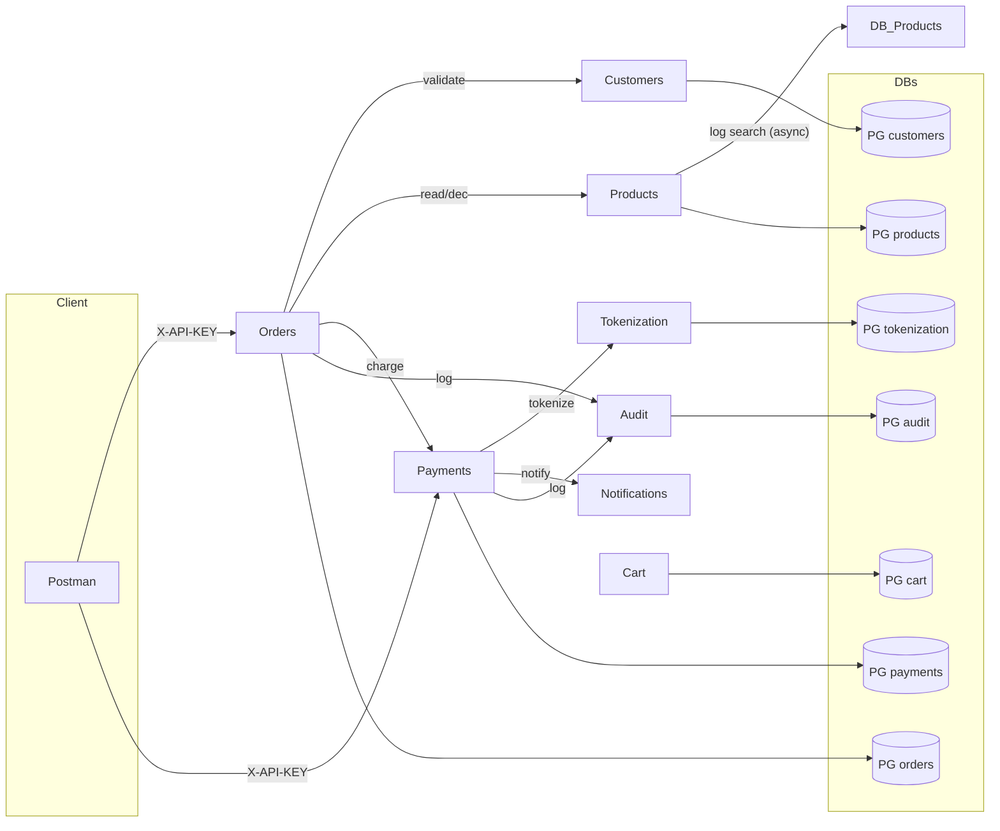

# Reto Técnico — FARMATODO (microservicios)

Este repositorio implementa un flujo de compras con microservicios en Java 17 + Spring Boot 3, persistencia en PostgreSQL, Docker/Docker Compose, autenticación por API Key, cifrado de datos sensibles y procesos asíncronos (notificaciones por email y auditoría centralizada).
Incluye colecciones Postman, pruebas, y guías para despliegue local y en GCP.

### Microservicios y puertos
| Servicio              | Puerto | Descripción breve                                                                                  |
| --------------------- | -----: | -------------------------------------------------------------------------------------------------- |
| tokenization-service  |   8081 | Tokeniza tarjetas (AES-GCM + HMAC). Rechazo probabilístico configurable.                           |
| customers-service     |   8082 | CRUD de clientes (email/phone únicos).                                                             |
| payments-service      |   8083 | Cobros con probabilidad de rechazo + reintentos. Llama a tokenization. Notifica por email. Audita. |
| orders-service        |   8085 | Orquestador: valida stock, calcula total, llama a payments, descuenta stock, audita.               |
| products-service      |   8084 | CRUD + búsqueda con stock mínimo, decremento de stock, logging asíncrono de búsquedas.             |
| notifications-service |   8086 | Envío de emails vía SMTP (Gmail App Password).                                                     |
| cart-service          |   8087 | Carrito por cliente (agregar/listar/borrar ítems).                                                 |
| audit-service         |   8088 | Logs centralizados (eventos con `txId`).                                                           |

Tokenization: http://34.135.158.232:8081/actuator/health

Customers: http://34.135.158.232:8082/actuator/health

Payments: http://34.135.158.232:8083/actuator/health

Products: http://34.135.158.232:8084/actuator/health

Orders: http://34.135.158.232:8085/actuator/health

Notifications: http://34.135.158.232:8086/actuator/health

Cart: http://34.135.158.232:8087/actuator/health

Audit: http://34.135.158.232:8088/actuator/health

Todas las APIs requieren X-API-KEY (excepto /ping/swagger/health según whitelist).

## Arquitectura (visión general)

## Seguridad

Autenticación por API Key en header X-API-KEY.

Cifrado AES-GCM de payloads sensibles (Tokenization).

HMAC-SHA256 para token público (irrevocable al PAN).

MDC/Tracing: header X-TX-ID (si no viene, se genera).

## Variables de entorno (principales)

Usa .env (local/compose) y variables en GCP (VM/Container/Cloud Run):

# Postgres

PG_USER=postgres
PG_PASSWORD=root

# API Key única para simplificar (puedes separarlas)
API_KEY=dev-secret

# Tokenization

CRYPTO_KEY_HEX=00112233445566778899AABBCCDDEEFF00112233445566778899AABBCCDDEEFF
TOKEN_HMAC_SECRET=change-me
TOKEN_REJECTION_PROB=0.15

# Payments
PAYMENT_REJECTION_PROB=0.20
PAYMENT_MAX_RETRIES=2
PAYMENT_BACKOFF_MS=200

# Notifications (Gmail)
##### MAIL_FROM=tu_gmail@gmail.com
##### MAIL_USERNAME=tu_gmail@gmail.com
##### MAIL_PASSWORD=app_password_16_chars

Cada micro también soporta overrides (*_BASE_URL) para apuntar a otros servicios por DNS del compose (ej: http://products-service:8084).

## Docker Compose (multi-servicio)

docker-compose.yml (incluye Postgres por servicio y todos los micros).
Comandos:

# 0) (opcional) build jars locales si NO usas Docker multi-stage en todos
##### mvn -DskipTests package -pl tokenization-service,customers-service,products-service,orders-service,payments-service,cart-service,notifications-service,audit-service -am

# 1) Construir imágenes
##### docker compose build

# 2) Levantar todo

##### docker compose up -d

# 3) Ver estado / logs
##### docker compose ps
##### docker compose logs -f payments-service

Importante: dentro de contenedores no uses localhost para otros micros/DB. Usa el nombre del servicio (p. ej. products-service:8084).

## Cómo correr local (sin Docker)

Levanta Postgres locales (puertos distintos o un único instance con varios DBs).

Exporta variables de entorno (API keys, SMTP).

En cada micro:

cd <micro> && mvn spring-boot:run

Ajusta application.yml con JDBC locales (ya los tienes) y URLs remotas entre servicios (localhost:puerto).

## Despliegue en GCP

### Opción A — VM (Compute Engine)
##### Crea VM (Ubuntu/Debian), instala Docker + Docker Compose.
##### Lleva el repo a la VM (git clone).

##### Abre firewall para puertos 8081–8088 (o configura un reverse proxy/ingress).

##### Configura .env (API_KEY, SMTP, etc.).

##### docker compose up -d.

### Opción B — Cloud Run (1 micro = 1 servicio)

##### Para cada micro: gcloud builds submit --tag gcr.io/<PROYECTO>/<imagen>

##### gcloud run deploy --image gcr.io/... --allow-unauthenticated --set-env-vars ...

Para Postgres usa Cloud SQL y VPC Connector o PG públicas, y ajusta SPRING_DATASOURCE_URL.

## Colecciones Postman

##### Incluye las colecciones (sugerencia de nombres; ya las fuiste usando):

##### Tokenization.postman_collection.json

##### Customers.postman_collection.json

##### Products.postman_collection.json

##### Cart.postman_collection.json

##### Payments.postman_collection.json

##### Orders.postman_collection.json

##### Notifications.postman_collection.json

##### Audit.postman_collection.json (health + consulta básica)

#### Variables Postman recomendadas
##### {{api_key}}=dev-secret
##### {{tokenization_base}}=http://localhost:8081
##### {{customers_base}}=http://localhost:8082
##### {{payments_base}}=http://localhost:8083
##### {{products_base}}=http://localhost:8084
##### {{orders_base}}=http://localhost:8085
##### {{notifications_base}}=http://localhost:8086
##### {{cart_base}}=http://localhost:8087
##### {{audit_base}}=http://localhost:8088

En producción, reemplazamos localhost por la IP 34.135.158.232.
 
## Endpoints (resumen ultra-rápido)

##### Tokenization (8081)

##### GET /ping → pong

##### POST /api/v1/tokenize
##### Body:

##### { "pan":"4111111111111111","cvv":"123","expMonth":12,"expYear":2030,"name":"John Doe" }

##### 200: {"token":"<id>","last4":"1111","brand":"VISA","status":"ISSUED"}
##### 422/402 si rechazo probabilístico.

##### Customers (8082)

##### POST /api/v1/customers

##### GET /api/v1/customers/{id}

##### (PUT/PATCH/DELETE/list) según implementado.

##### Products (8084)

##### POST /api/v1/products (crear)

##### GET /api/v1/products/{id}

##### GET /api/v1/products (listar)

##### GET /api/v1/products/search?q=... (solo stock ≥ MIN_STOCK_VISIBLE)

##### POST /api/v1/products/{id}/decrement?qty={n}

##### Cart (8087)

##### POST /api/v1/carts/{customerId}/items → { "productId":1,"qty":2 }

##### GET /api/v1/carts/{customerId}

##### DELETE /api/v1/carts/{customerId}/items/{productId}

##### Payments (8083)

##### POST /api/v1/payments/charge
##### Body con card:

##### {
##### "orderId":"ORD-CARD-{{RANDOM}}","amount":20000,"currency":"COP",
##### "card":{"pan":"4111111111111111","cvv":"123","expMonth":12,"expYear":2030,"name":"John Doe"},
##### "customerEmail":"tu@mail.com"
##### }

##### Body con token:

##### { "orderId":"ORD-TOKEN-{{RANDOM}}", "amount":15000, "currency":"COP", "token":"tok-demo", "customerEmail":"tu@mail.com" }

##### 200 aprobado → notifica + audita
##### 422 rechazado después de reintentos → notifica + audita

##### Orders (8085)

##### POST /api/v1/orders
##### Body:

##### {
##### "customerId":1, "address":"Calle 123 #45-67, Bogotá",
##### "tokenCard":"<token>",        // o "card": { ... } si no tienes token
##### "items":[{"productId":1,"qty":2}],
##### "customerEmail":"tu@mail.com"
##### }

##### → Valida customer, carga productos, calcula total, llama a payments, si aprueba descuenta stock en products, marca PAID, audita.

##### GET /api/v1/orders/{id}

##### Notifications (8086)

##### POST /api/v1/notify/payment (interno, lo llama payments)

##### Audit (8088)

##### POST /api/v1/logs (interno, lo llaman payments y orders)

##### GET /actuator/health

##  Pruebas y cobertura

Ejecutar pruebas:

mvn clean verify

Se incluye JaCoCo con objetivo ≥80% para módulos críticos (services y utilidades).

Sugerido: tests de service (mocks repos y clientes), y tests de controller con MockMvc.

### DEMO rápida (orden completa)

Crear customer (customers-service).

Crear product (products-service) con stock suficiente.

(Opcional) Tokenizar tarjeta (tokenization-service) para obtener token.

Crear order (orders-service) con tokenCard o con card:

Orders llamará a Payments.

Payments tokeniza (si no hay token), hace reintentos probabilísticos, notifica por email y audita.

Orders si aprobado, descuenta stock en Products, marca PAID y audita.

Consultar order por id y ver stock disminuido.