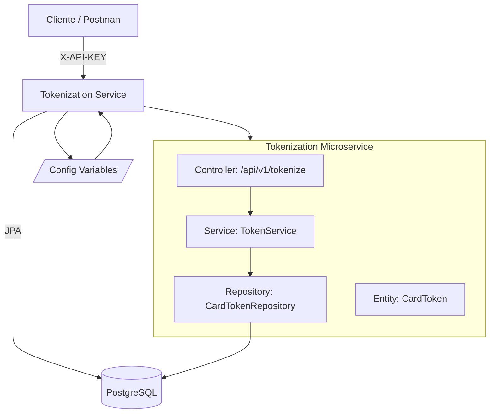
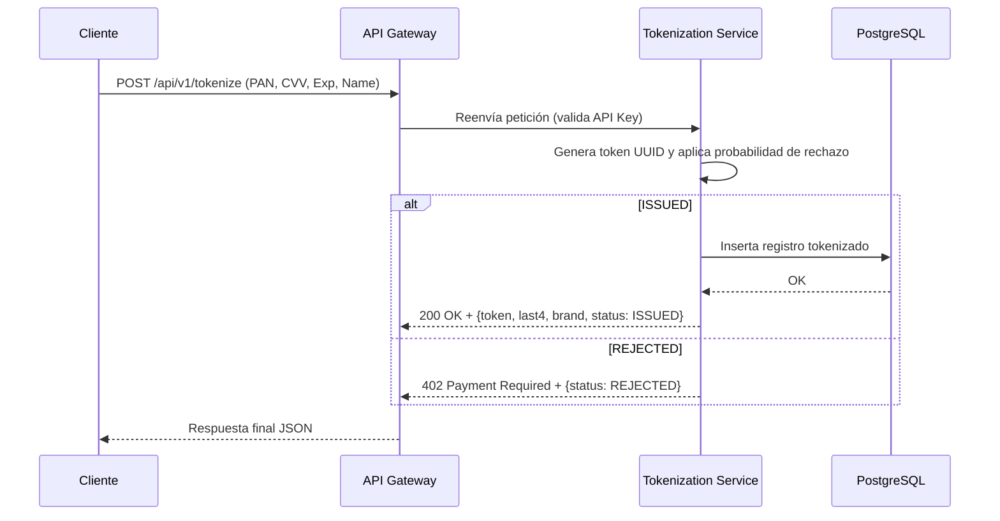

# 🪪 Tokenization Service — Farmatodo (Reto Técnico Backend)

**Microservicio #1:** Tokenización de tarjetas.  
Construido en **Spring Boot 3.5.6 + Java 17**, con **PostgreSQL** y despliegue en **Docker**.  
Cumple todos los requisitos solicitados en el reto técnico de Farmatodo:

✅ Endpoint `/ping`  
✅ Autenticación por `X-API-KEY`  
✅ Tokenización con probabilidad de rechazo configurable  
✅ Persistencia y auditoría de tokens emitidos  
✅ Cifrado de datos sensibles (opcional)  
✅ Configuración vía variables de entorno  
✅ Dockerfile y `docker-compose.yml` para ejecución local

---

## 🏗️ Arquitectura General

El micro pertenece al dominio **Seguridad y Pagos**, encargado de **tokenizar tarjetas de clientes** antes de que los demás microservicios (Payments, Orders, etc.) procesen transacciones.

### 📦 Diagrama de componentes



## Estructura de proyecto
```mermaid
tokenization/
├── src/
│   ├── main/java/com/farmatodo/tokenization/
│   │   ├── TokenizationApplication.java
│   │   ├── config/
│   │   │   ├── ApiKeyAuthFilter.java
│   │   │   └── CryptoConfig.java
│   │   ├── controller/
│   │   │   ├── HealthController.java
│   │   │   └── TokenizeController.java
│   │   ├── domain/
│   │   │   ├── CardToken.java
│   │   │   └── TokenStatus.java
│   │   ├── dto/
│   │   │   ├── TokenizeRequest.java
│   │   │   └── TokenizeResponse.java
│   │   ├── repository/
│   │   │   └── CardTokenRepository.java
│   │   ├── service/
│   │   │   └── TokenService.java
│   │   └── util/
│   │       └── CardBrandDetector.java
│   └── resources/
│       └── application.yml
├── Dockerfile
├── docker-compose.yml
├── pom.xml
└── README.md
```
## Configuración del Entorno

| Variable                     | Descripción                               | Valor por defecto                                                  |
| ---------------------------- | ----------------------------------------- |--------------------------------------------------------------------|
| `API_KEY_TOKENIZATION`       | Clave de autenticación para llamadas HTTP | `dev-secret`                                                       |
| `TOKEN_REJECTION_PROB`       | Probabilidad de rechazo (0.0 - 1.0)       | `0.15`                                                             |
| `CRYPTO_KEY_HEX`             | Clave AES-256 para cifrado en hex         | `00112233445566778899AABBCCDDEEFF00112233445566778899AABBCCDDEEFF` |
| `SPRING_DATASOURCE_URL`      | URL JDBC de Postgres                      | `jdbc:postgresql://tokenization-db:5432/tokenization`              |
| `SPRING_DATASOURCE_USERNAME` | Usuario BD                                | `postgres`                                                         |
| `SPRING_DATASOURCE_PASSWORD` | Password BD                               | `root`                                                             |
| `SERVER_PORT`                | Puerto del micro                          | `8081`                                                             |

## 🧱 Base de Datos
```mermaid
erDiagram
    CARD_TOKEN {
        BIGSERIAL id PK
        VARCHAR(64) token UNIQUE
        VARCHAR(4) last4
        VARCHAR(20) brand
        TIMESTAMP created_at
        VARCHAR(16) status
        BYTEA encrypted_payload
        VARCHAR(32) payload_iv_hex
    }
```
## 🐳 Ejecución con Docker
### 1️⃣ Compilar el JAR
mvn clean package -DskipTests

## 2️⃣ Levantar con Docker Compose
##### docker compose up -d --build

### Esto levantará:

##### tokenization-db → PostgreSQL 15
##### tokenization → microservicio Spring Boot en localhost:8081

### Endpoints disponibles

| Método | Endpoint           | Descripción                             | Autenticación         |
| ------ | ------------------ | --------------------------------------- | --------------------- |
| `GET`  | `/ping`            | Verifica disponibilidad                 | ❌ No requiere API Key |
| `POST` | `/api/v1/tokenize` | Tokeniza tarjeta y devuelve token único | ✅ `X-API-KEY`         |

### Ejemplos de prueba

#### ✅ Healthcheck
```mermaid
curl http://localhost:8081/ping
```
#### Respuesta:
```mermaid
{ "message": "pong" }
```
### Tokenización exitosa
```mermaid
curl -X POST http://localhost:8081/api/v1/tokenize \
-H "X-API-KEY: dev-secret" \
-H "Content-Type: application/json" \
-d '{
"pan": "4111111111111111",
"cvv": "123",
"expMonth": 12,
"expYear": 2030,
"name": "John Doe"
}'
```
#### Respuesta (200 OK):
```mermaid
{
"token": "3d4ebf98-8d7f-45a9-a186-df19ab8ab157",
"last4": "1111",
"brand": "VISA",
"status": "ISSUED"
}
```
#### Tokenización rechazada
```mermaid
(Probabilidad según TOKEN_REJECTION_PROB)

{
"token": null,
"last4": "1111",
"brand": "VISA",
"status": "REJECTED"
}
Código HTTP: 402 Payment Required
```
#### Diagrama de secuencia (flujo tokenización)

### Comandos útiles
| Acción                    | Comando                                            |
| ------------------------- | -------------------------------------------------- |
| Compilar proyecto         | `mvn clean package -DskipTests`                    |
| Ejecutar local sin Docker | `java -jar target/tokenization-0.0.1-SNAPSHOT.jar` |
| Levantar con Docker       | `docker compose up -d --build`                     |
| Ver logs                  | `docker compose logs -f tokenization`              |
| Detener contenedores      | `docker compose down`                              |
